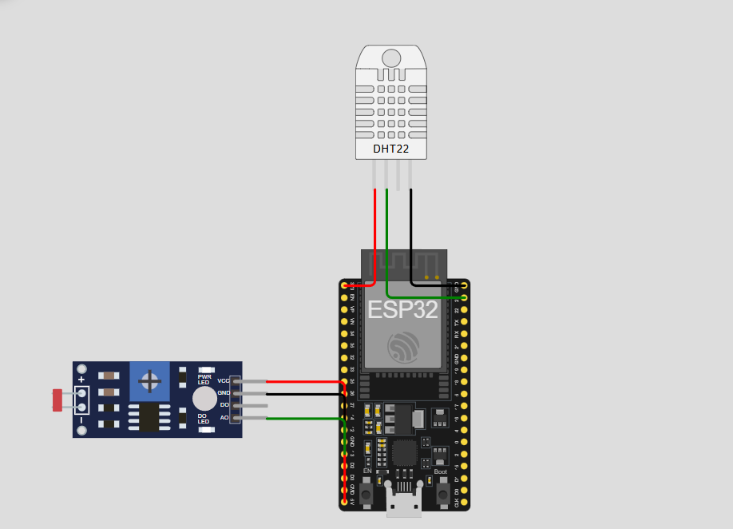

#  Checkpoint 5 Edge-Computing – Leitura de DHT22 e LDR via MQTT

##  Descrição do Projeto
Este projeto realiza a leitura dos sensores DHT22 (temperatura e umidade) e LDR (luminosidade) utilizando o ESP32, com envio dos dados para um servidor MQTT.  
A comunicação é feita de forma simples e direta, o dispositivo apenas conecta, coleta os dados e publica no servidor MQTT configurado (porta 69).

---

## Objetivo
- Demonstrar a captura de dados dos sensores **DHT22** e **LDR** via ESP32.  
- Enviar os dados coletados via protocolo **MQTT**.  
- Permitir visualização no aplicativo **MyMQTT** ou outro cliente MQTT compatível.  

---

## Componentes Utilizados
| Componente | Quantidade | Função |
|-------------|-------------|--------|
| ESP32 | 1 | Microcontrolador principal |
| DHT22 | 1 | Sensor de temperatura e umidade |
| Módulo LDR | 1 | Sensor de luminosidade analógico |
| Jumpers | Vários | Ligações entre os componentes |

---

## Esquemático de Ligações

### 🧾 DHT22
| Pino DHT22 | Conexão ESP32 |
|-------------|----------------|
| VCC | 3.3V |
| SDA | GPIO 23 |
| GND | GND |

### 💡 LDR (Módulo)
| Pino Módulo LDR | Conexão ESP32 |
|-----------------|----------------|
| AO (Analógico) | GPIO 13 |
| VCC | 5V |
| GND | GND |


<p>
  
</p>

---

## Simulação no Wokwi
<p align="center">
 <a href="https://wokwi.com/projects/445707707360387073" target="_blank">
 
  </a>
  </p>

## Código (ESP32)

```cpp
#include <ArduinoJson.h>
#include <DHT.h>
#include <Wire.h>
#include <WiFi.h>
#include <PubSubClient.h>

const char* SSID = "FIAP-IOT";

const char* PASSWORD = "F!@p25.IOT";
const char* BROKER_MQTT = "54.221.163.3";

const int BROKER_PORT = 1883;
const char* TOPICO_SUBSCRIBE = "/TEF/device069/cmd";

const char* TOPICO_PUBLISH_1 = "/TEF/device069/attrs";

const char* TOPICO_PUBLISH_2 = "/TEF/device069/attrs/p";
const char* ID_MQTT = "fiware_069";
const char* topicPrefix = "device069";


#define DHTPIN 4       
#define DHTTYPE DHT22  
#define LDR_PIN 34  


WiFiClient espClient;
PubSubClient MQTT(espClient);
DHT dht(DHTPIN, DHTTYPE);


void initSerial() {
  Serial.begin(9600);
}

void reconectWiFi() {
  if (WiFi.status() == WL_CONNECTED) return;
  WiFi.begin(SSID, PASSWORD);
  while (WiFi.status() != WL_CONNECTED) {
    delay(100);
    Serial.print(".");
  }
  Serial.println("\nConectado ao Wi-Fi. IP: " + WiFi.localIP().toString());
}

void initWiFi() {
  delay(10);
  Serial.println("Conexao WI-FI");
  reconectWiFi();
}

void mqtt_callback(char* topic, byte* payload, unsigned int length) {
  String msg;
  for (int i = 0; i < length; i++) msg += (char)payload[i];
  Serial.println("Mensagem recebida: " + msg);
}

void initMQTT() {
  MQTT.setServer(BROKER_MQTT, BROKER_PORT);
  MQTT.setCallback(mqtt_callback);
}

void reconnectMQTT() {
  while (!MQTT.connected()) {
    Serial.print("Tentando conectar ao broker...");
    if (MQTT.connect(ID_MQTT)) {
      Serial.println("Conectado!");
      MQTT.subscribe(TOPICO_SUBSCRIBE);
    } else {
      Serial.println("Falha. Tentando em 2s.");
      delay(2000);
    }
  }
}

void VerificaConexoesWiFIEMQTT() {
  if (!MQTT.connected()) reconnectMQTT();
  reconectWiFi();
}

void setup() {
  initSerial();
  initWiFi();
  initMQTT();
  dht.begin();
}

void loop() {
  VerificaConexoesWiFIEMQTT();
  MQTT.loop();

  float umidade = dht.readHumidity();
  float temperatura = dht.readTemperature();
  int LDR = analogRead(LDR_PIN);

  if (isnan(umidade) || isnan(temperatura)) {
    Serial.println("Erro ao ler o sensor DHT!");
    return;
  }

  Serial.print("Umidade: ");
  Serial.print(umidade, 1);
  Serial.print("%  ");

  Serial.print("Temperatura: ");
  Serial.print(temperatura, 1);
  Serial.print(" °C  ");

  Serial.print("LDR: ");
  Serial.println(LDR);

  StaticJsonDocument<256> doc;
  doc["umidade"] = umidade;
  
  doc["temperatura"] = temperatura;
  doc["LDR"] = LDR;

  char buffer[256];
  serializeJson(doc, buffer);

  MQTT.publish(TOPICO_PUBLISH_2, buffer);
  Serial.print("Enviado: ");
  Serial.println(buffer);

  delay(1000);
}
```
## 👥 Integrantes do Grupo

<p align="center">
  <a href="https://github.com/VitorAlcantara-tech">
    <br>
    <sub><b>Vitor Alcantara</b></sub>
  </a>
  &nbsp;&nbsp;&nbsp;&nbsp;
  <a href="https://github.com/thiagolima-tech">
    <br>
    <sub><b>Thiago Lima</b></sub>
  </a>
  &nbsp;&nbsp;&nbsp;&nbsp;
  <a href="https://github.com/maatvasques">
    <br>
    <sub><b>Matheus Vasques</b></sub>
  </a>
  &nbsp;&nbsp;&nbsp;&nbsp;
  <a href="https://github.com/Arriatea">
    <br>
    <sub><b>Marco Aurélio</b></sub>
  </a>
  &nbsp;&nbsp;&nbsp;&nbsp;
  <a href="https://github.com/BernardoYuji">
    <br>
    <sub><b>Bernardo Hanashiro</b></sub>
  </a>
</p>
